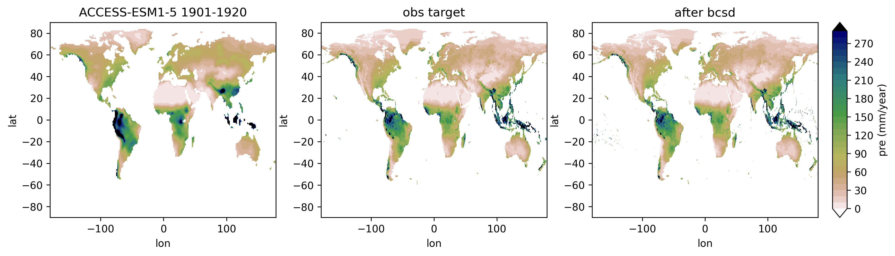
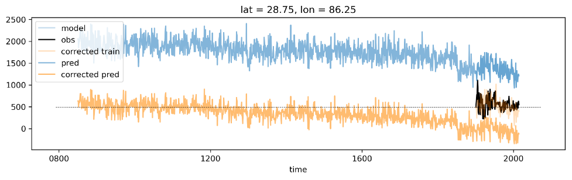
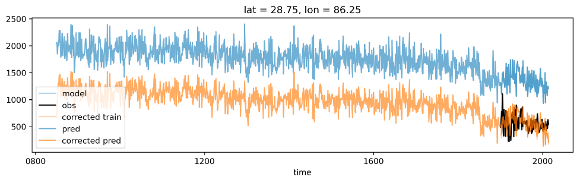

# scikit-bcsd

An minimal BCSD package in Python.

BCSD is a method for statistical downscaling and postprocessing models for climate and weather model simulations.

This project is mainly modified from `pangeo-data/scikit-downscale`, we only keep the core code.

## Example

We apply BCSD to model monthly precipitation, with GPCC as ref. Raw data are not provided in this repo, but you can check file structure in the notebooks.

Comparation of mean spatial pattern before/after bcsd:


## Detailed steps

- Align model and obs data so that they have the same varname, time axis settings and longitude format
- Interpolate obs on model grid
- For each gridpoint, apply quantile mapping
- Get coarse and bias-corrected result (BC)
- For the whole coarse field, apply spatial disaggregation
- Get fine and bias-corrected result (BCSD)

## Improvements

- when applying `QuantileMapper` with detrend, data should be aligned according to their lowfreq average (basline), rather than any single value.

  An example with significant trend is shown below:

  In previous code the first element is aligned. Pred series has large offset from obs target.
  

  After modification, pred and target during reftime (1901-2014) are well aligned.
  
- Add Spatial Aggregator from [this PR](https://github.com/pangeo-data/scikit-downscale/pull/57) , inplement additive (var like temprature) and multiplicative (var like precipitation)

## File Structure

```bash
.
...
├── example
│   ├── data  # raw input data
│   │   ├── cmip
│   │   │   └── pre-ACCESS-ESM1-5-historical-1850-2014.nc
│   │   └── obs
│   │       └── pre-GPCC-1901-2020.nc
│   ├── interim  # aligned input data
│   │   ├── pre.ACCESS-ESM1-5.1901-2014.nc
│   │   ├── pre.GPCC.1901-2014.nc
│   │   ├── pre.valid_grid.GPCC.nc
│   │   └── pre.valid_grid.GPCC.on.ACCESS-ESM1-5.nc
│   ├── result  # downscaled data and plots for check
│   │   ├── pre.ACCESS-ESM1-5.1901-1920.bcsd.nc
│   │   ├── pre.GPCC.1901-1920.bcsd.nc
│   │   └── pre.ACCESS-ESM1-5.1901-1920.png
│   └── src  # core scripts
│       ├── 00.check_input.ipynb
│       ├── 01.preprocess.py
│       ├── 02.check_interim.ipynb
│       ├── 03.bcsd.py
│       ├── 04.check_result.ipynb
│       ├── skdownscale -> ../../skdownscale  # you should place this package under your project folder
│       └── utils.py
...
└── skdownscale  
    ├── pointwise_models
		|	 ...
    │   ├── bcsd.py  # BC core here
		|	 ...
    └── spatial_models
			...
        ├── sd.py  # SD core here
			 ...
```
